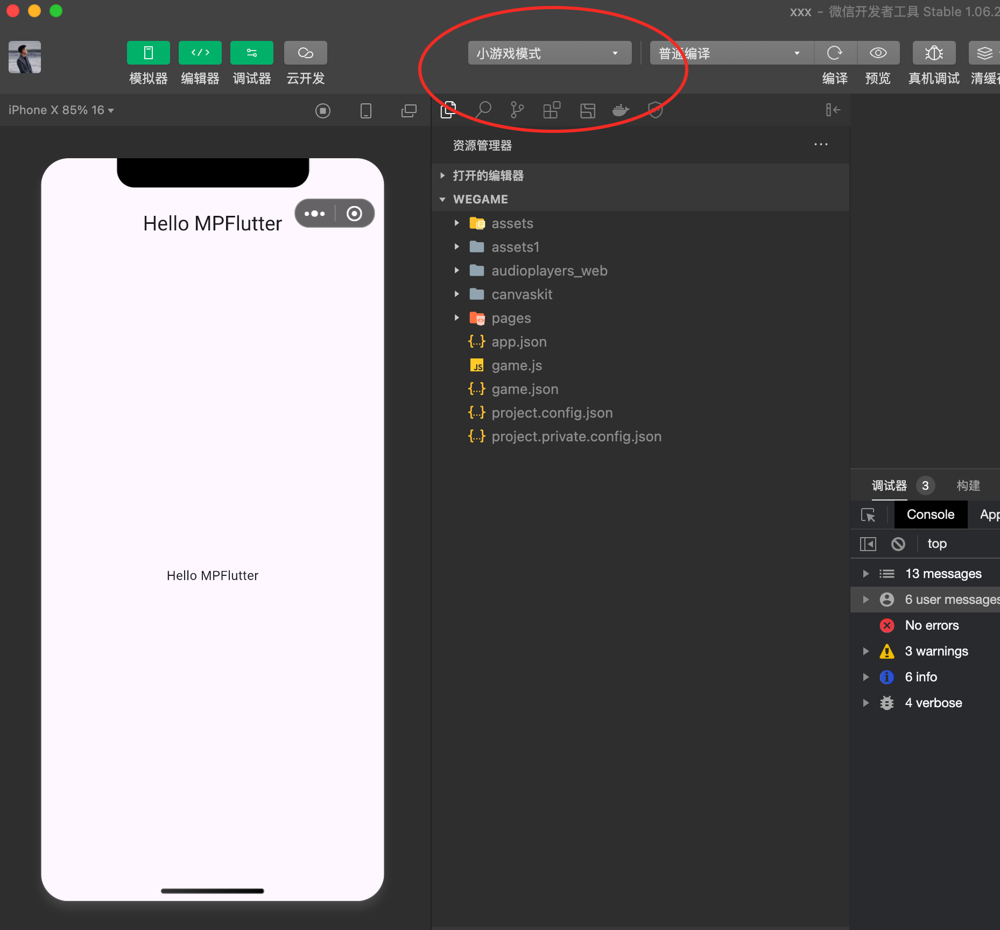

# mpflutter_gallery

A new Flutter project.

## Getting Started

This project is a starting point for a Flutter application.

A few resources to get you started if this is your first Flutter project:

- [Lab: Write your first Flutter app](https://docs.flutter.dev/get-started/codelab)
- [Cookbook: Useful Flutter samples](https://docs.flutter.dev/cookbook)

For help getting started with Flutter development, view the
[online documentation](https://docs.flutter.dev/), which offers tutorials,
samples, guidance on mobile development, and a full API reference.

## 这是一个纯净版的MPFlutter项目

小游戏构建后产物在`build/wegame`目录下,其中 pages/index/main.dart.js 是Flutter编译后的JavaScript代码,这部分代码需要微信官方团队加入公共库，否则可能会在审核期间被判断为代码重复。

